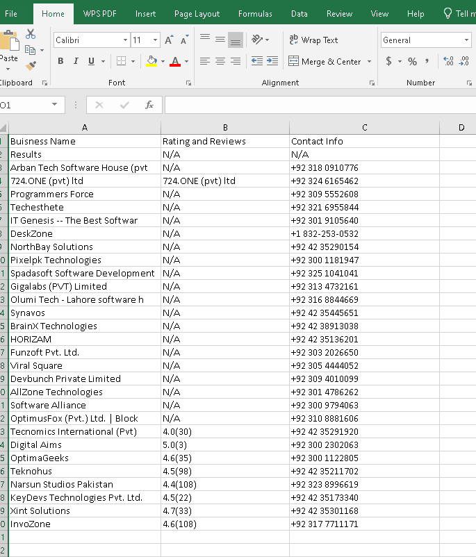

# 🗺️ Google Maps B2B Lead Harvester


An automated **local business lead generator** built with **Python and Playwright**.
This tool extracts structured contact data directly from Google Maps for **B2B sales, marketing campaigns, and lead generation**.

---

# 📌 Project Overview

This scraper targets Google Maps search results and automatically collects **valuable business intelligence**.

Instead of manually searching businesses and copying information, this script automates the entire workflow.

The project demonstrates **advanced DOM manipulation** by bypassing traditional page scrolling and directly targeting the isolated results container:

```
div[role="feed"]
```

This allow the scraper to trigger **Google Maps infinite scrolling APIs** and collect large datasets efficiently.

---

# ⚙️ Data Extraction Workflow

This project automates the entire lead generation pipeline:

Search Query
↓
Google Maps Results
↓
Targeted Panel Scrolling
(div[role="feed"])
↓
Business Card Parsing
↓
Phone Number Extraction (Regex)
↓
Data Structuring (Pandas)
↓
Excel Export

Final Output:
Software_Houses_in_Johar_Town_Lahore_lead.xlsx

---

# 🚀 Business Value

Marketing agencies, real estate firms, and B2B SaaS companies constantly need **fresh localized lead lists**.

This tool automates the tedious process of manual prospecting by instantly extracting:

✔ **Business Names**
✔ **Clean Phone Numbers** (parsed using Regex)
✔ **Review Counts**
✔ **Rating Metrics**

This enables teams to quickly build **targeted outreach lists for sales and marketing campaigns.**

---

# 🎯 Use Cases

This tool can be used for:

• **Lead generation for marketing agencies**
• **Local business prospecting**
• **Real estate outreach campaigns**
• **SaaS customer acquisition**
• **Market research & competitor analysis**
• **Building targeted B2B contact databases**

---

# 🛠️ Technical Stack

**Language**

- Python 3.x

**Browser Automation**

- Playwright (Chromium)

**Data Processing**

- Pandas
- Regular Expressions (Regex)

**Advanced Techniques**

- Targeted JavaScript DOM manipulation
- Dynamic URL query injection
- Infinite scroll automation
- Unstructured string parsing

---

# ⚙️ Core Features

## 1️⃣ Targeted Infinite Scroll

Instead of scrolling the entire page, the script injects JavaScript to scroll only the **Google Maps results panel**:

```
div[role="feed"]
```

This bypasses standard browser scrolling limitations and loads hundreds of results efficiently.

---

## 2️⃣ Regex Data Cleaning

Phone numbers in Google Maps are often mixed with operating hours or other text.

Example raw text:

```
Open ⋅ Closes 5 PM ⋅ +92 300 1234567
```

The script uses **Regular Expressions** to extract only the actionable phone number:

```
+92 300 1234567
```

---

## 3️⃣ Dynamic Querying

The scraper supports **dynamic niche and location parameters**.

Example queries:

```
Gyms in London
Dentists in New York
Real Estate Agents in Dubai
```

These are automatically converted into Google Maps search URLs to generate leads on demand.

---

# 📸 Demo

Example output generated by the scraper.



This screenshot shows:

• Google Maps search results  
• Automated scraping process  
• Extracted business leads saved to Excel

---

# 📊 Sample Dataset

A **real dataset generated by this scraper** is included in this repository.

You can download and inspect the extracted leads:

Software_Houses_in_Johar_Town_Lahore_lead.xlsx

This dataset contains **software houses located in Johar Town, Lahore** collected directly from Google Maps.

Example data format:

| Business Name      | Rating | Phone           |
| ------------------ | ------ | --------------- |
| XYZ Software House | 4.5    | +92 300 1234567 |
| ABC Solutions      | 4.3    | +92 321 9876543 |

---

# 📂 Project Structure

gmaps-business-data-scraper
│
├── main.py
├── requirements.txt
├── README.md
│
├── screenshots
│ ├── banner.png
│ └── output.png
│
└── Software_Houses_in_Johar_Town_Lahore_lead.xlsx

---

# 💻 Installation & Setup

## 1️⃣ Clone the repository

```bash
git clone https://github.com/yourusername/gmaps-business-data-scraper.git
cd gmaps-business-data-scraper
```

---

## 2️⃣ Install dependencies

```bash
pip install -r requirements.txt
```

---

## 3️⃣ Install Playwright browser

```bash
playwright install chromium
```

---

# 🚀 How to Run

Execute the script from your terminal:

```bash
python main.py
```

The scraper will:

1. Open Google Maps
2. Search the specified niche and location
3. Automatically scroll results
4. Extract business data
5. Save leads to an Excel file

---

# ⚠️ Disclaimer

This project is intended for **educational purposes and ethical data extraction**.

Users should respect:

- Website Terms of Service
- Data privacy regulations
- Responsible scraping practices

---

# 👨‍💻 Author

**Muhammad Shakeel**

Built for scalable **data engineering, lead generation automation, and business intelligence workflows.**

---

# ⭐ Support

If you find this project useful, consider giving the repository a ⭐ on GitHub.
